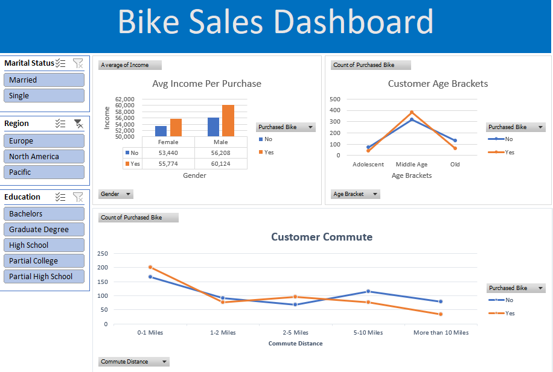

# 🚲 Bike Sales Performance Dashboard

A comprehensive Excel dashboard analyzing sales conversion rates against customer demographics and socioeconomic factors. This tool enables stakeholders to identify high-value target markets and optimize commute-based marketing efforts.

## 📊 Dashboard Preview

## 🛠️ Key Components & Design Rationale

* **Interactive Segmentation (Slicers):** Implemented dynamic filtering by **Marital Status**, **Region**, and **Education Level** to allow immediate comparison across distinct demographic groups. This reduces time-to-insight for specific marketing personas.
* **Multivariate Analysis:**
    * **Avg Income Per Purchase (Gender vs. Purchase Status):** Highlights income disparities in customer groups and quantifies the economic gap between purchasers and non-purchasers.
    * **Customer Age Brackets (Age Group vs. Count):** Visualizes the core "Middle Age" customer peak, aiding in generational marketing alignment.
    * **Customer Commute (Distance vs. Count):** Tracks the critical "0-1 Mile" and "5-10 Mile" market segments, providing insights for distribution and logistics.
* **Data Transformation:** Performed comprehensive data cleaning including **missing value handling** and **data binning** to categorize commute distances into logical groups.

## 📁 Files in Repository
* `Bike_Sales_Dashboard.xlsx`: The final interactive report.
* `raw_data.xlsx`: The uncleaned dataset used for analysis (optional, but highly recommended).

## 💡 How to Use
1.  Download the `Bike_Sales_Dashboard.xlsx` file.
2.  Open in Excel.
3.  Ensure **Macros** are enabled if any are used (optional).
4.  Interact with the **Slicers** on the left to filter the entire dashboard.

---
